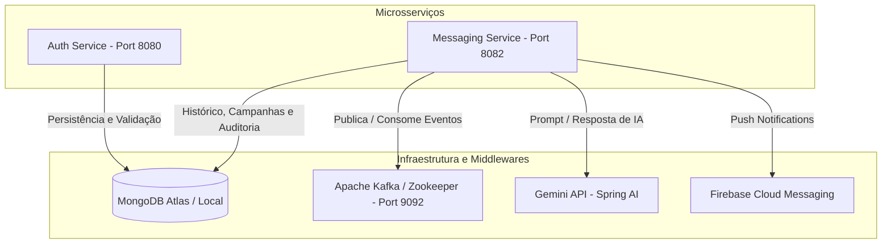

# WTC Messenger - Sistema de Mensageria, CRM e Orquestração 🚀

O **WTC Messenger** é uma plataforma robusta de CRM e comunicação em tempo real baseada em uma arquitetura de microsserviços escrita em **Java 17 / Spring Boot**. Ela foi projetada para lidar com segmentação de clientes, orquestração assíncrona de mensagens, disparo de campanhas enriquecidas por Inteligência Artificial (Gemini) e notificações Push instantâneas.

A infraestrutura utiliza conteinerização via **Docker**, mensageria assíncrona com **Apache Kafka** e persistência NoSQL com **MongoDB**.

---

## 🏗️ Arquitetura do Ecossistema Backend

A solução está estruturada em dois microsserviços autônomos acompanhados de middlewares:



### 📦 Componentes Principais
1.  **Auth Service** (Porta `8080`):
    *   **Autenticação JWT**: Emite e valida Tokens JWT (Access e Refresh) de forma totalmente stateless.
    *   **Controle de Acessos**: Separação de escopo baseada em perfis (`ROLE_OPERATOR` e `ROLE_CUSTOMER`).
    *   **Criptografia**: Senhas salvas com hash BCrypt seguro.
    *   **Massa de Dados (`DataInitializer`)**: Popula automaticamente o MongoDB com dados padrão de testes (`operador@wtc.com` / `admin123` e `cliente@wtc.com` / `cliente123`) na primeira execução.
2.  **Messaging Service** (Porta `8082`):
    *   **CRM & Clientes**: CRUD completo de clientes, criação de tags dinâmicas e geração da **Visão 360° unificada** (`GET /customers/{id}/timeline`).
    *   **Copiloto de IA (`Spring AI`)**: Gera campanhas promocionais estruturadas por Inteligência Artificial a partir de prompts em linguagem natural.
    *   **Real-time WebSockets (`/chat`)**: Handler WebSocket nativo reativo que associa a conexão ativa do usuário (validando o JWT na query string) para entrega de mensagens em milissegundos.
    *   **Consumers/Workers Kafka**: `MessageWorker` e `CampaignWorker` escutam tópicos assíncronos e empurram notificações via WebSocket/Firebase em background.
    *   **Auditoria por Aspecto (AOP)**: Intercepta de forma automática ações de CRUD e disparos salvando trilhas de auditoria (`AuditLog`) para segurança e governança.

---

## ⚙️ Pré-requisitos

*   [Docker Desktop](https://www.docker.com/products/docker-desktop) instalado e rodando.
*   Chave de API do **Google Gemini** (caso queira usar o Copiloto de IA).
*   Banco **MongoDB** (Atlas em nuvem ou rodando localmente).

---

## 🚀 Como Executar o Backend

### 1. Configurar as Variáveis de Ambiente
O projeto lê credenciais de um arquivo `.env` na raiz para segurança da informação. Crie o arquivo `.env` no diretório raiz do backend:

```env
# JWT & Segurança
JWT_SECRET=seu_secret_base64_aqui

# Banco de Dados
MONGODB_URI=sua_uri_do_mongodb_atlas_aqui

# Inteligência Artificial (Gemini)
GEMINI_API_KEY=sua_chave_de_api_do_gemini_aqui
```

> ⚠️ **Importante**: O Copiloto de IA (`/campaigns/generate`) requer uma `GEMINI_API_KEY` válida para que o Spring AI consiga se comunicar com os modelos generativos da Google.

### 2. Iniciar os Serviços no Docker
Na raiz do backend, execute o comando de orquestração:
```bash
docker compose up --build -d
```
Isso baixará as imagens do Zookeeper e Kafka, construirá as imagens do `auth-service` e `messaging-service` e iniciará tudo em background.

Para acompanhar os logs de inicialização e requisições em tempo real:
```bash
docker compose logs -f
```

---

## 🧪 Estratégia de Testes e Cobertura (TDD)

O projeto segue boas práticas de engenharia de software com pirâmide de testes completa (Unitários, Integração e E2E).

### 1. Rodar os Testes Unitários via Docker (Recomendado - Sem dependência de JDK local)
Você pode executar o Maven direto dentro dos contêineres temporários:

*   **Auth Service**:
    ```bash
    docker compose run --rm auth-service mvn test
    ```
*   **Messaging Service**:
    ```bash
    docker compose run --rm messaging-service mvn test
    ```

### 2. Rodar via Maven Local (Requer JDK 21 e Maven instalados)
*   **Auth Service**:
    ```bash
    cd auth-service && ../mvnw clean test
    ```
*   **Messaging Service**:
    ```bash
    cd messaging-service && ./mvnw clean test
    ```

### 3. Testes de Integração Automatizados de Ponta a Ponta (E2E)
Temos um script automatizado que simula o fluxo completo de uma requisição (Auth -> Token -> POST Message -> Kafka -> WebSocket/Firebase -> Mongo):

1. Certifique-se de que os contêineres estão no ar (`docker compose up -d`).
2. Execute o script na raiz do backend:
   ```bash
   chmod +x test-e2e.sh && ./test-e2e.sh
   ```

### 📊 Cobertura Atual de Testes:
*   **`AuthServiceTest`**: Garante a correta geração e renovação de tokens JWT refratários e validação contra credenciais inválidas.
*   **`CampaignServiceTest`**: Valida regras de negócio de marketing e integração com os modelos da IA.
*   **`MessageServiceTest`**: Garante o fluxo correto de envio 1:1 e orquestração de tópicos Kafka.
*   **`CampaignWorkerTest`**: Valida a escuta reativa em segundo plano de campanhas enviadas pelo broker.

---

## 📝 Detalhes e Diferenciais Técnicos

### 1. WebSocket Handler (`ws://localhost:8082/chat?token=JWT`)
Como os dispositivos móveis possuem certas restrições para cabeçalhos HTTP padrão durante a fase de Handshake do WebSocket, o endpoint de chat do `messaging-service` aceita o token JWT passado de forma segura como parâmetro de Query (`?token=...`), efetuando a autenticação e validação no momento da conexão.

### 2. Auditoria Silenciosa com Spring AOP
Utilizando Programação Orientada a Aspectos (`AuditAspect.java`), toda criação de cliente, envio de mensagem ou alteração crítica é automaticamente interceptada e catalogada no banco MongoDB sem poluir as classes de serviço principais.

### 3. Resiliência Firebase FCM
O app tenta disparar notificações FCM em tempo real usando a chave `firebase-service-account.json` (localizada em `src/main/resources`). Caso a credencial não esteja configurada, o backend entra em modo de contingência automático (Logs) para evitar que o envio de mensagens seja interrompido por falta de credenciais do Firebase.

---

**Desenvolvido como Desafio BRQ & FIAP**  
*Garante conformidade técnica total para as entregas de arquitetura NoSQL, Kafka e Microsserviços do 2º Ano.*
